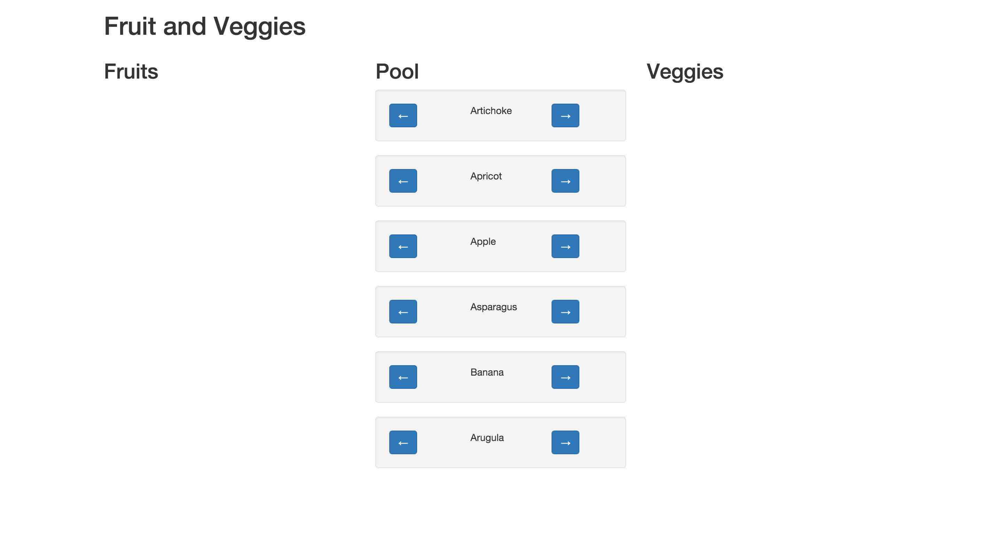

#Fruit and Veggies

The goal of this assignment is to build a simple game to help people learning to differentiate between fruit and vegetables. 

The app should be built entirely using AngularJS (no jQuery).

###Hints
* All 3 lists should be in the same controller. ng-repeat is your best friend.
* A test file is provided for you, which only has a few fruits and veggies. This will make testing easier, because `fruit_and_veggies.js` has quite a few fruits and veggies!

##Final Product

##Requirements

A 3 column layout using Bootstrap has been created for you.

####Column 1: Fruit
* Empty when the app loads
* Each item has a right arrow which when clicked will remove the item and move it back to the middle column (column 2)

####Column 2: Fruit and Veggies
* Contains all of the fruit and vegetables when the app loads (combined and shuffled randomly)
* Each item has a left and a right arrow
    * Left arrow removes the item from this list and puts it in the left (Fruit) list.
    * Right arrow removes the item from this list and puts it in the right (Vegetables) list.

####Column 3: Vegetables
* Empty when the app loads
* Each item has a left arrow which when clicked will remove the item and move it back to the middle column (column 2)

Once all fruit / vegetables are sorted (the middle list is empty) all incorrect items in the other two lists should be highlighted in red. If all of the items are in the correct list the app should tell the user that they won.

##Bonus

Add an up / down arrow to each list item in the fruit and vegetable list (not the middle list) which when clicked will move the item up / down the list.

Require the user to alphabetize the list after sorting in to vegetables / fruit.
